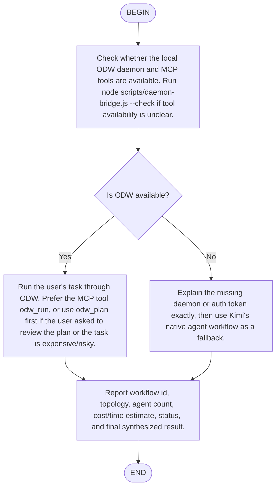

# Ultracode Through Open Dynamic Workflows for Kimi Code CLI

Invoke this as `/flow:ultracode <task>` for the guided flow, or `/skill:ultracode <task>` to load the playbook directly.

The ODW MCP tools should already be available from `~/.kimi-code/mcp.json`. The bridge scripts referenced below live next to this skill in `scripts/`.

## Daemon Path

1. Prefer MCP tools when available: call `odw_health`, then `odw_run` for direct execution or `odw_plan` first when the user wants to review the plan, the task is expensive, or mutation risk is high.
2. If MCP tools are unavailable but the daemon is reachable, use the local bridge:
   - `node scripts/daemon-bridge.js plan "<task>"`
   - `node scripts/daemon-bridge.js exec plan.json`
   - `node scripts/daemon-bridge.js status <workflowId>`
   - `node scripts/daemon-bridge.js result <workflowId>`
3. Report the workflow id, topology, agent count, cost/time estimate, and final synthesized result. Do not redo the same work manually while ODW is running it.

## Kimi-Native Fallback

If the daemon is unavailable, state that full ultracode requires the daemon, then use Kimi Code CLI's native planning and editing flow: discovery -> parallel work -> adversarial verification -> synthesis.

Never include secrets in prompts, plans, logs, or workflow artifacts.
