# Open Dynamic Workflows — Handoff

## 1. 🎯 Executive Summary

Open Dynamic Workflows (ODW) is an MIT-licensed system that brings Claude Code-style dynamic, script-orchestrated multi-agent workflows to any agentic coding harness — OpenCode, Codex, Antigravity, VS Code, or a bare shell. A model writes one JavaScript `execute(context)` function; a local daemon runs that script inside a WebAssembly-isolated QuickJS sandbox, fanning each `agent()` call out to your own LLM provider through a concurrency queue, checkpointing to SQLite so runs survive crashes, and adversarially verifying results before returning them. There is no hosted backend, no telemetry, and no cost beyond your own API usage (or zero, with a local Ollama model). It runs cross-platform on Node 20+. Current status: fully implemented and tested (unit + integration + a real crash-resume test + a live run against a free MiniMax model), running locally and published to GitHub.

## 2. 📋 The Problem

From the original requirements: a single LLM acting as the orchestrator of many sub-agents exhausts its context window past roughly ten agents, because it must track every agent turn-by-turn. The leading agentic harness solved this with a *script-as-orchestrator* pattern — the model authors a JavaScript coordination script once, and a runtime executes it while the model stays out of the loop — enabling 100+ parallel agents, adversarial verification, and hour-long background runs. That capability was proprietary, expensive, and locked to one tool.

**Target audience:** developers using open or alternative agentic harnesses (OpenCode, Codex, Antigravity, VS Code) who want the same orchestration power without the lock-in or the subscription, running on their own machine with their own keys.

**Success criteria (from the spec):** replicate the script-as-orchestrator model faithfully; explicit five-phase planning; the runtime primitives `agent / parallel / pipeline / verify / loop / phase / log / checkpoint / budget / args / tools`; an optional local daemon for 100+ concurrent agents, background execution, and crash-resume; direct provider calls (Anthropic, OpenAI-compatible, Ollama); per-workflow token/cost budgets; SQLite/WAL state; HTTP + WebSocket API; platform plugins/adapters; zero hosting cost; MIT license.

## 3. 🏗️ Solution Overview

```mermaid
flowchart LR
    subgraph host[your machine]
      A[agent harness] -->|trigger| ADP[odw adapter]
      ADP -->|HTTP 127.0.0.1:7345| D[odw daemon]
      D --> SB[quickjs-wasm sandbox]
      SB -->|agent&#40;&#41; x N| Q[p-queue]
      Q --> P[provider adapter]
      SB -.checkpoint.-> DB[(sqlite + WAL)]
    end
    P --> LLM[(your LLM: Anthropic / OpenAI-compatible / Ollama)]
```



Key technical decisions:
- **Script-as-orchestrator**, faithful to the source pattern: the model emits `execute(context)`; the daemon runs it; the chat sees only the final result.
- **QuickJS compiled to WebAssembly** for the sandbox — engine-level isolation with a pure-JS install (no native build), chosen over the abandoned `vm2`.
- **The daemon is optional and local.** Adapters fall back to the host's native sub-agents when it isn't running.
- **State is durable.** SQLite with write-ahead logging + deterministic node identity makes crash-resume exact.
- **Three provider wire-formats** behind one normalized interface; one OpenAI adapter serves every OpenAI-compatible endpoint via a configurable base URL.

## 4. ⚡ Quick Start

```bash
git clone https://github.com/Suraj1235/open-dynamic-workflows
cd open-dynamic-workflows
npm install
npm run setup
```

`npm run setup` writes `~/.odw/config.json` and generates the daemon auth token at `~/.odw/daemon.token` (see §11 "Daemon authentication"). Then point it at a model by editing `~/.odw/config.json` — add one key and you're done:

```json
{
  "apiKeys": { "anthropic": "sk-ant-..." },
  "models": { "planning": "gpt-4o-mini", "default": "claude-sonnet-4-6" }
}
```

Run the daemon and a workflow from a shell (no editor needed):

```bash
odw-daemon start
odw-daemon run --prompt "workflow: review every file in src for bugs" --cwd ./your-project
```

(`odw-daemon` is not on npm yet; to get the global bin from the clone, run `npm install -g ./packages/daemon`, or drive it from the repo with `npm start` / `npm run odw -- run --prompt "..."`.)

The single environment variable the code reads is `ODW_DAEMON_PORT` (verified via `grep -rEho 'process\.env\.[A-Z_]+' packages/*/src` → only `ODW_DAEMON_PORT`). `ODW_HOME` overrides the data directory. No keys are required in the environment — the config file or a local Ollama model is enough.

## 5. 🧱 Tech Stack

- **Node.js ≥ 20** (ESM throughout). Rationale: `p-queue` is ESM-only and the maintained `better-sqlite3` prebuilds cover the supported Node range.
- **better-sqlite3 ^12.11.1** — synchronous SQLite with prebuilt Windows/macOS/Linux binaries for Node 20/22/23/24+ (no compiler needed for normal installs).
- **quickjs-emscripten 0.32.0** — WASM QuickJS sandbox. Pinned exactly (it is the security boundary).
- **express ^5.2.1** + **ws ^8.21.0** — HTTP API and WebSocket events on loopback.
- **p-queue ^9.3.0** — concurrency control for agent HTTP calls.
- **ajv ^8.20.0** — JSON-schema validation of structured agent output.
- **commander ^14.0.2** — CLI.
- Dev: **c8** (coverage), **eslint**. Tests use Node's built-in `node:test`.

## 6. 📁 Project Structure

```
open-dynamic-workflows/
├── packages/
│   ├── core/                 planning, topology selection, script generation (pure, no I/O)
│   ├── daemon/               the engine: sandbox, queue, providers, sqlite, http/ws, cli
│   ├── opencode-plugin/      OpenCode plugin: triggers, custom tools, slash commands
│   ├── codex-adapter/        Codex skill folder + zero-dep daemon bridge
│   ├── antigravity-adapter/  Antigravity skill + saved workflow
│   └── vscode-extension/     tree view, dashboard webview, status bar
├── examples/workflows/       runnable orchestration scripts (security audit, migration, research)
├── .github/workflows/ci.yml  test / lint / security jobs (Ubuntu + Windows, Node 20 & 22)
├── Dockerfile                multi-stage, non-root, foreground daemon
└── docker-compose.yml        daemon + persistent volume + healthcheck
```

- `packages/core` — domain logic; importable by the daemon and by plugins (trigger detection runs plugin-side too).
- `packages/daemon` — the only package that touches the network, disk, or the model providers.
- `packages/*-adapter` / `*-plugin` / `*-extension` — host-specific shells that talk to the daemon over HTTP only.

## 7. 💻 Development Workflow

```bash
npm install                      # all workspaces
npm test                         # node:test across every package
npm run coverage                 # c8 with an 80% line gate on core + daemon
npm run lint                     # eslint
node packages/daemon/src/cli.js start --foreground   # run the daemon attached, for debugging
node packages/daemon/src/cli.js db-check             # migration dry-run against a temp database
```

The daemon logs newline-delimited JSON; `odw-daemon logs --follow` tails it. For team members running their own agentic harness against a local checkout, set `ODW_DAEMON_PORT` if 7345 is taken. If you use this repo's own `.claude/settings.json` hooks, note they are a build-time convenience and are not required to develop ODW.

## 8. 🧪 Testing & Quality

- **279 tests pass** across the workspace packages, including core, daemon, MCP server, OpenCode, Codex, Cursor, Kimi, Gemini, Zed/zcode-style skills, VS Code, Antigravity, and OpenClaw adapters.
- **Coverage:** core **96.82%** lines, daemon **91.52%** lines, both over the enforced 80% gate (`c8 --check-coverage --lines 80`).
- **Test pyramid:** unit (pure functions, providers with injected `fetch`, sandbox isolation), integration (a real HTTP daemon against an in-process mock model — plan → exec → result, WebSocket replay, stop-control, and an explicit **crash-resume test** asserting cached nodes never re-run), and shipped-example execution.
- **CI** (`.github/workflows/ci.yml`): `test` on a 2×2 matrix (Ubuntu + Windows, Node 20 + 22), `lint`, and `security` (`npm audit --audit-level=high` + a secret-pattern scan). All green at handoff with **0 vulnerabilities**.
- A live run against the free **minimax-m3-free** model confirmed the full planning → sandbox → real-agent → verification → synthesis path end-to-end.

## 9. 🎨 Design System

The product's surfaces are the README, the CLI, and the VS Code webview (there is no web frontend). Tokens are in `design-system/MASTER.md`.

- **Brand color** `#6366F1` (indigo) — OKLCH `oklch(0.585 0.207 277)`.
- **Status** — success `oklch(0.72 0.17 155)`, warn `oklch(0.8 0.16 85)`, danger `oklch(0.6 0.21 25)`.
- **Webview neutrals** — background `oklch(0.97 0.01 280)`, surface `oklch(0.93 0.015 280)`, text `oklch(0.25 0.04 280)`; never pure black/white.
- **CLI** — indigo headers, `✓ / ✗ / ⚠ / ▶` glyphs, aligned key/value columns. Every command has success, failure, and `--help` states.
- **Dashboard interactive elements** carry text + icon (never color alone); user content is HTML-escaped; focus styling inherits the VS Code theme.

## 10. 🚀 Deployment

This is a locally-run developer tool, not a hosted service — "deployment" means publishing the source and running the daemon on the user's machine.

- **Published repository (live):** `https://github.com/Suraj1235/open-dynamic-workflows` — public, MIT.
- **Local daemon (the runtime):** `odw-daemon start` launches a detached background process on `127.0.0.1:7345`, surviving the shell that started it.
  - Start: `odw-daemon start` · Stop: `odw-daemon stop` · Status/health: `odw-daemon status` (or `GET http://127.0.0.1:7345/health` → HTTP 200).
  - PID file, logs, SQLite DB, and config all live under `~/.odw/` (override with `ODW_HOME`).
- **Containers:** `docker compose up -d` runs the daemon foreground in a non-root image with a persistent `~/.odw` volume and a healthcheck.
- **Rollback:** it is a local process — `odw-daemon stop` and `npm uninstall -g odw-daemon` fully remove it; no migrations to reverse on a user machine.

## 11. 🔧 Operations

- **Config:** `~/.odw/config.json` (see `.env.example` and §4). Holds `daemon` (port, concurrency, log level), `apiKeys` (per provider), `models` (planning / default / fallback), `budget`, `safety`, `git`, and optional `baseURLs` for OpenAI-compatible endpoints.
- **Agent setup:** `odw-daemon integrate <mcp|codex|cursor|kimi|zed|zcode|opencode|antigravity|openclaw|all>` writes the supported MCP config, project instructions/rules, skill folder, or local plugin wrapper for that host; `zcode` gets generic MCP plus zcode-facing guidance and skills over the Zed-compatible context-server layout. Use `--target <dir>` for project-local configs and `--home <dir>` for user-level config locations. Add `--json` when another agent or installer needs stable machine-readable output.
- **Readiness check:** `odw-daemon doctor <agent>` verifies the expected integration files and daemon health, then exits non-zero with the missing file or start hint if setup is incomplete. Add `--json` for CI and automated agent handshakes.
- **Live host smoke:** `npm run smoke:hosts` performs a temporary full install, verifies the combined `AGENTS.md` guidance covers generic MCP hosts, Kimi Code, Zed, and zcode, starts a temporary daemon, parses `doctor all --json` including explicit zcode checks, and probes installed host CLIs. Missing hosts are reported as skipped; host app/permission failures are reported without failing the ODW integration smoke.
- **Strict host smoke:** add `-- --require-host opencode` (or another host name) when the machine is expected to prove that host CLI is runnable.
- **OpenAI-compatible routing:** set `baseURLs.default` + `apiKeys.default` to use OpenCode Zen / Azure / vLLM / LM Studio / Groq with any model id; or `baseURLs.<name>` + a `name:model` model id for a named endpoint. Routing: `claude-*`→Anthropic, `gpt-*`/`o*`→OpenAI, `ollama:*`→Ollama, `name:model`→`baseURLs.name`, else→`baseURLs.default`.
- **Reading a failure:** failed runs surface the reason at the top level — `odw-daemon status` / `GET /workflows/:id` include an `error` field, and `odw-daemon run` prints `reason:` on failure. `odw-daemon logs` has the full detail. Note free/small models occasionally return malformed JSON; the agent queue self-corrects by re-prompting with the validation error, but a model that never returns valid JSON will fail the run with a clear `did not match the required JSON shape` reason.
- **Environment variables:** `ODW_DAEMON_PORT` (port override), `ODW_HOME` (data dir), `ODW_DAEMON_TOKEN` (daemon auth token override), and provider key fallbacks `ANTHROPIC_API_KEY` / `OPENAI_API_KEY` / `GOOGLE_API_KEY`.
- **Daemon authentication:** the daemon requires a Bearer token on every HTTP/WebSocket request except `GET /health` (`packages/daemon/src/server.js` enforces it). `npm run setup` generates a 64-character token at `~/.odw/daemon.token` (file mode `0600`); the daemon reads it from there, or from the `ODW_DAEMON_TOKEN` environment variable (env wins over the file), and auto-generates one on first start if neither is present. The bundled CLI and adapters attach `Authorization: Bearer <token>` automatically; a 401 prints how to fix it (copy the token from `~/.odw/daemon.token` or set `ODW_DAEMON_TOKEN`). Token-shaped strings are redacted from logs and HTTP errors.
- **Secrets:** keys live only in the local config or the environment. They are never logged, never written into workflow/journal rows, and never returned in HTTP errors; the logger redacts key-shaped strings.
- **Logs:** `~/.odw/logs/daemon.log`, newline-delimited JSON with `timestamp`, `level`, `message`.
- **Monitoring:** `GET /health` returns active workflows and agent occupancy; the WebSocket `/ws/:id` streams per-workflow events (journal-replayable with `?after=<id>`).

## 12. 🧠 Architectural Decisions

The decisions that shaped the codebase.

- **Sandbox: quickjs-emscripten (WASM QuickJS).** Alternatives: `vm2` (abandoned 2023, critical CVEs), `node:vm` (not a security boundary), `isolated-vm` (needs a native toolchain), SES (irreversible global lockdown). Chose WASM-QuickJS for true isolation with a pure-JS install. Trade-off: values cross the boundary as JSON strings. Revisit if the host needs to pass live object handles.
- **ESM, Node ≥ 20.** Alternatives: CommonJS on Node 18. `p-queue` v9 is ESM-only and SQLite prebuilds need Node 20. Trade-off: drops Node 18. Revisit when the LTS floor moves and `node:sqlite` is stable.
- **better-sqlite3 ^12.** Alternative: `node:sqlite` (still experimental in some supported runtimes). Synchronous, prebuilt, simple across Node 20+.
- **Adapters talk to the daemon only over HTTP.** Alternative: shared in-process library per host. Keeps each host package thin and the daemon the single source of truth. Trade-off: a network hop on loopback.
- **Honest platform adapters.** Codex has no plugin marketplace and Antigravity no public automation API, so those adapters use real extension points (skills, `AGENTS.md`, saved workflows, the VS Code extension) and document the limits rather than faking a marketplace listing.

## 13. ⚠️ Known Limitations & TECH_DEBT

From `.studio/todos.md` and `.studio/blocked.md`.

- **Budget hard-stop can overshoot** by up to `maxConcurrency` in-flight calls (a wave already dispatched finishes). Workaround: set the cap slightly below your true ceiling. Revisit if precise accounting matters.
- **Daemon trust boundary is loopback + an 8 MB request limit + Bearer-token auth.** Binding to `127.0.0.1` plus a required Bearer token (see §11 "Daemon authentication") is intentional for a localhost tool; `GET /health` is the only unauthenticated route. Revisit the model before ever binding to a non-loopback interface.
- **WebSocket backpressure is unhandled** (fine for a localhost dashboard). Revisit if used over a slow link.
- **OpenCode plugin lacks a `session.idle` background push** of daemon progress. Workaround: the `odw_status` / `odw_workflows` tools. Revisit when polling proves insufficient.
- **Codex marketplace / Antigravity automation API** do not exist; those adapters ship skills + bridge scripts. Revisit if/when official APIs land.

## 14. 📚 Lessons Learned

- The deferred-promise bridge (QuickJS `newPromise` → resolve → `executePendingJobs`) gives genuine in-flight concurrency inside the sandbox without the Asyncify build — a spike proved five host calls in flight at once before any production code was written. Worth de-risking the sandbox first.
- Provider "structured output" is three different wire shapes (Anthropic `output_config`, OpenAI `response_format`, Ollama `format`), so a tolerant JSON extractor with a re-prompt retry is more robust across free/cheap models than trusting native JSON modes.
- A Windows-authored config file carries a UTF-8 BOM that Node's `JSON.parse` rejects; the loader strips it. Test on the OS you ship to.
- Recommendation: keep `core` pure and free of I/O — it made the planner trivially testable and reusable plugin-side.

## 15. 🚪 Onboarding for New Contributors

Reading order:
1. `README.md` — what it is and how to run it.
2. This file — operational picture.
3. `packages/daemon/schema.sql` + `packages/core/src/types.js` — the SQLite schema and the type contracts (the source of truth for state and the HTTP API).
4. `packages/core/src/planner.js` → `script-generator.js` — how a prompt becomes a runnable script.
5. `packages/daemon/src/sandbox.js` + `guest-prelude.js` — how the script runs and where the primitives live.
6. `packages/daemon/src/runtime.js` — the lifecycle glue (exec, checkpoint, resume, budget).

Good first tasks (from TECH_DEBT): add a `session.idle` progress push to the OpenCode plugin; make the budget hard-stop cancel the in-flight wave; add `<thead>`/`scope` to the dashboard table for screen readers; add per-package READMEs; add a Prometheus-style `/metrics` endpoint.

## 16. 🔗 References

- State + API contracts (source of truth): `packages/daemon/schema.sql`, `packages/core/src/types.js`, `packages/daemon/src/server.js` (HTTP routes).
- Engine internals: `packages/daemon/src/{sandbox,runtime,agent-queue,providers}.js`.
- Runnable examples: `examples/workflows/`.
- External docs used while building: QuickJS-emscripten, the OpenCode plugin/SDK type definitions, the Anthropic Messages API, OpenAI Chat Completions, the Ollama API, and the GitHub REST repos API.
- Design tokens: `design-system/MASTER.md`
- External docs used: QuickJS-emscripten (github.com/justjake/quickjs-emscripten), `@opencode-ai/plugin` & SDK type definitions, Anthropic Messages API, OpenAI Chat Completions, Ollama API, GitHub REST repos API.

## 17. 🤖 Studio Prime Continuation

This project was built with Studio Prime, an autonomous phase-gated engineering workflow.

- **Resume:** run `claude` in this directory and say **"Continue Studio Prime"**. State lives in `.studio/` (outside the product repo, in the parent workspace).
- **Settings/hooks:** `.claude/settings.json` (workspace root) holds a PostToolUse audit hook; `.claude/settings.local.json` holds per-user permissions. Neither is required to develop ODW.
- **Run an adversarial review manually:** dispatch the Task tool with `subagent_type: "general-purpose"` and the three-round (steelman → adversarial → synthesis) protocol, pointing it at the phase artifacts you want audited.
- The phase verdicts live in `.studio/apex_red_team/reviews/phase[1-6]_verdict.{md,json}`.
