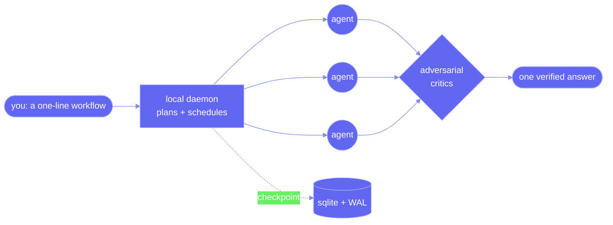

<div align="center">

<picture>
  <source media="(prefers-color-scheme: dark)" srcset="assets/banner-dark.svg">
  
</picture>

<br><br>

**The model plans the swarm. A local script runs it. Your chat only sees the answer.**

An open-source engine for dynamic, multi-agent workflows where a *script* is the orchestrator, not the model — the pattern behind Claude Code's dynamic workflows and ultracode, for **OpenCode, OpenAI Codex, Google Antigravity, and VS Code**. Bring your own model, run a local daemon, keep everything on your machine.

[**Quick start**](#quick-start)&nbsp;·&nbsp;[**How it works**](#how-it-works)&nbsp;·&nbsp;[**Topologies**](#topologies)&nbsp;·&nbsp;[**Compare**](#how-it-compares)&nbsp;·&nbsp;[**FAQ**](#faq)

<br>

[](https://github.com/Suraj1235/open-dynamic-workflows/actions/workflows/ci.yml)


</div>

---

<div align="center">

</div>

---

## What it is

When you ask one LLM to coordinate fifty agents, it spends its context window keeping track of the other forty-nine. The fix is to have the model write a plan **once** — a plain JavaScript `execute()` function — and then step out of the loop while a runtime executes it. The model is the author. The script is the orchestrator. That capability had been locked to one proprietary tool; this is the same idea, MIT-licensed, on your machine.

| Script-as-orchestrator | It verifies its own work | Runs on your machine |
| :--: | :--: | :--: |
| The model writes a plan once. A local daemon runs the swarm. | Adversarial critics catch false positives before you see them. | Bring your own model. No telemetry. Nothing leaves your box. |

```
you ──▶ "workflow: audit every endpoint for missing auth"
        │
        ├─ plan      25 agents · adversarial verification · ~$0.30 · ~4 min
        ├─ confirm   [run] [view script] [edit]
        └─ run       ▶ wf_9f3c2a  → 200 endpoints checked, 6 real issues, report written
```

---

## How it works

The model never babysits the swarm. It writes one `execute(context)` function and hands it to the daemon, which runs it inside a WASM-isolated QuickJS sandbox where the only things in scope are the workflow primitives — `agent`, `parallel`, `pipeline`, `verify`, `loop`, `checkpoint`. Every `agent()` call becomes one HTTP request to your model provider, scheduled through a concurrency queue. Your chat window only sees the final answer.



- **It survives.** State lives in SQLite with write-ahead logging. Kill the daemon mid-run, start it with `--resume`, and completed agents come back from cache — only unfinished work re-runs. A failed agent is dropped, not fatal; the run keeps going. Node identity is `sha1(workflow | phase | role | prompt)`, so replay is exact.
- **It doesn't trust its own agents.** A finding isn't a finding until a panel of skeptics has tried to knock it down. The `verify` primitive runs critics that hunt false positives, challenge severity, and look for what's missing, then keeps only what survives a quorum.
- **It won't blow the context window.** Each agent gets a fresh window and only its distilled result crosses back — the same isolation big harnesses use to run huge tasks. On top of that, every call is measured against the model's real context window and, if it would overflow, the input is compacted by dropping *whole* structural elements (never a mid-JSON cut). A provider "context too long" error is caught and self-healed with a bounded compact-and-retry instead of crashing the run — so it holds up on small and free models, not just 200K-token ones.

---

## Quick start

> **Install from GitHub** — not on the npm registry yet, so install by cloning. (An unrelated package happens to sit at the name `open-dynamic-workflows` on npm — that isn't this project.) Same steps on macOS, Linux, and Windows.

```bash
git clone https://github.com/Suraj1235/open-dynamic-workflows
cd open-dynamic-workflows
npm install
npm run setup
```

<div align="center">

</div>

`npm run setup` writes `~/.odw/config.json`. Add one key and you're done:

```json
{
  "apiKeys": { "anthropic": "sk-ant-..." },
  "models": { "planning": "gpt-4o-mini", "default": "claude-sonnet-4-6" }
}
```

Then drive it from a shell — no editor required:

```bash
odw-daemon start
odw-daemon run --prompt "workflow: find every TODO that hides a real bug" --cwd ./my-project
```

If a model has no key or route, `odw-daemon run` tells you up front — before planning — exactly which line of the config to fix. No silent first-run failures.

<details>
<summary><b>Run on a free local model, or any OpenAI-compatible endpoint</b></summary>

<br>

No cloud key? Run a local model with **Ollama** and pay nothing — point all three roles at it so planning and fallbacks stay free too:

```json
{ "models": { "planning": "ollama:llama3", "default": "ollama:llama3", "fallback": "ollama:llama3" } }
```

**Any OpenAI-compatible endpoint** works — OpenCode Zen, Azure OpenAI, vLLM, LM Studio, Together, Groq:

```json
{
  "baseURLs": { "default": "https://opencode.ai/zen/v1" },
  "apiKeys":  { "default": "your-key" },
  "models":   { "planning": "minimax-m3-free", "default": "minimax-m3-free", "fallback": "minimax-m3-free" }
}
```

Prefer not to install globally? Every command also runs from the repo: `npm start`, `npm run status`, `npm run odw -- run --prompt "..."`.

</details>

Model routing is automatic:

| Model id | Routes to |
| --- | --- |
| `claude-*` | Anthropic |
| `gpt-*`, `o*` | OpenAI |
| `ollama:*` | local Ollama (free) |
| `provider:model` | a named `baseURLs.<provider>` |
| anything else | `baseURLs.default` |

---

## Topologies

The planner picks the simplest shape that fits the task instead of throwing a swarm at everything.

<div align="center">

</div>

| Topology | Shape | Good for |
|----------|-------|----------|
| MapReduce | split → map in parallel → reduce | auditing 500 files, the same check across many items |
| Pipeline | stage → stage → stage, per item, no barrier | migrate → test → fix, where item A streams ahead of item B |
| Adversarial | propose → critique → fix → re-verify | anything that has to be *correct*, not just plausible |
| Consensus | many evaluators → weighted vote | uncertain facts, research, judgement calls |
| Tree search | expand → score → prune → backtrack | root-cause hunts, branching exploration |
| Hybrid | the above, composed | real features that have several phases |

---

## Inside your agent

The adapters are how your existing tool drives the engine. **On OpenCode the engine runs *inside* the plugin, on your already-configured model — no daemon and no second API key.** Everywhere else the engine runs in the local daemon (its own key) and the adapter is a thin client over its localhost API. Each is a separate package — install only what you use.

| Editor / agent | How it connects | No-key, no-daemon native mode? |
| --- | --- | --- |
| **OpenCode** | drop-in plugin (`"plugin": ["odw-opencode"]` in `opencode.json`) — triggers on "run a workflow", `ultracode`, or `/deep-research` | **Yes — validated live on OpenCode 1.2.27**: runs ODW's real engine *through* OpenCode's own model via the plugin SDK (`session.prompt`); a full multi-agent run completed in 93 real round-trips. No daemon, no extra key. (Daemon optional for 100-way fan-out + crash-resume. `ODW_HOST_MODEL=provider/model` pins the agent model; `ODW_DEBUG=1` for diagnostics.) |
| **Codex · Antigravity · OpenClaw** | a skill folder (`SKILL.md` + a zero-dependency bridge script) that teaches the agent to plan first, then call the daemon — the OpenClaw one is ClawHub-publishable | **No** — these hosts expose no model API to extensions, so the keyless path is the host orchestrating itself natively (not the ODW engine); the full engine needs the daemon + one key |
| **VS Code** | extension: a sidebar of live workflows, a dashboard webview, a status bar that spins while agents run (loads in Antigravity unchanged) | n/a (UI client over the daemon API) |

Honest note: only OpenCode currently lets a plugin invoke the host's configured model, so it's the only platform where ODW is truly seamless and keyless. Codex is MCP-client-only with no host-model API; Antigravity locks model access to its internal engine; and MCP "sampling" (the one cross-host hook) is deprecated and unsupported by all three. Those adapters use the extension points those tools actually have — skills, `AGENTS.md`, saved workflows — and say so out loud rather than pretend to be keyless.

---

## The script the model writes

You never write one of these by hand, but it's worth seeing what the planner compiles — there's no magic underneath:

```js
async function execute(context) {
  phase("Discovery");
  const files = await context.tools.glob("src/routes/**/*.{js,ts}");

  phase("Audit");
  const findings = await parallel(
    files.map(f => () => agent({
      role: "security-auditor",
      prompt: `Check ${f} for missing auth. Return JSON {findings, confidence}.`,
      schema: { findings: "array", confidence: "number" },
      tools: ["read_file"],
    })),
    { maxConcurrency: 16 }
  );
  await checkpoint({ phase: "audit", findings });

  phase("Verification");
  const verified = await verify({
    target: findings,
    mode: "adversarial",
    critics: [
      { role: "false-positive-hunter", prompt: "Find false positives." },
      { role: "severity-validator",    prompt: "Challenge every severity rating." },
    ],
    consensusThreshold: 2,
  });

  phase("Synthesis");
  return agent({ role: "report-writer", prompt: `Write the report from ${JSON.stringify(verified)}` });
}

module.exports = { execute };
```

Runnable examples live in [`examples/workflows/`](examples/workflows): a security audit (MapReduce + adversarial), a JS→TS migration (pipeline), deep research (consensus), and **`studio-prime.workflow.js`** — an autonomous 6-phase product pipeline (Blueprint → Link → Architecture → Implement → Stylize → Release) where every phase is gated by an adversarial review. Run any of them with `odw-daemon run --script examples/workflows/<file> --cwd <project>`.

---

## How it compares

|  | Open Dynamic Workflows | Proprietary dynamic workflows | A plain agent loop |
|---|---|---|---|
| Orchestrator | a generated JS script | a generated JS script | the LLM, turn by turn |
| Runs on | your machine | a vendor's cloud | your machine |
| Works in | OpenCode, Codex, Antigravity, VS Code, shell | one vendor's tool | wherever it's built in |
| Parallel agents | up to your hardware (default 16) | yes | a handful before context fills |
| Crash-resume | yes (SQLite + WAL) | yes | no |
| Adversarial verification | built in | built in | you bolt it on |
| Bring your own model | Anthropic, OpenAI-compatible, Ollama, local | vendor's models | varies |
| Cost | $0 + your tokens (or free local) | subscription + tokens | your tokens |
| License | MIT | proprietary | varies |

---

## Safety, briefly

| Layer | What it means | Guarantee |
| --- | --- | --- |
| **Sandboxed** | the orchestration script runs in QuickJS compiled to WebAssembly | no `fs`, `process`, `require`, or network — only the primitives (we picked WASM-QuickJS over `vm2`, abandoned in 2023 with critical escape CVEs) |
| **Approval-gated** | file writes, shell, and git need approval; reads run free | nothing mutates without you, by default |
| **Local-only** | binds `127.0.0.1`, keys live in `~/.odw/config.json` | keys never hit logs, workflow rows, or HTTP errors; telemetry none |
| **Budgeted** | every run has a hard token + dollar ceiling | warns at 80%, stops at 100% |

---

## FAQ

<details>
<summary><b>Is this an open-source alternative to Claude Code's dynamic workflows / ultracode?</b></summary>
<br>
Yes. It replicates the same script-as-orchestrator architecture — the model writes one orchestration script, a runtime executes it — and makes it work outside any single vendor, MIT-licensed, on your own machine.
</details>

<details>
<summary><b>Which AI coding agents does it work with?</b></summary>
<br>
OpenCode (plugin), OpenAI Codex (skill + bridge), Google Antigravity (skill + saved workflow), VS Code (extension), and any shell via the <code>odw-daemon</code> CLI. The daemon is the engine; each adapter is a thin client over its local HTTP API.
</details>

<details>
<summary><b>Do I need an API key or a subscription?</b></summary>
<br>
No subscription, ever. Bring an Anthropic or OpenAI key, point at any OpenAI-compatible endpoint (Azure, vLLM, LM Studio, Groq, OpenCode Zen), or run a fully local model with <b>Ollama</b> for $0.
</details>

<details>
<summary><b>Does anything leave my machine?</b></summary>
<br>
Only the LLM API calls you configure. No telemetry, no hosted backend, no account. The daemon binds to localhost only and your keys never leave <code>~/.odw/config.json</code>.
</details>

<details>
<summary><b>What makes it reliable at scale?</b></summary>
<br>
Deterministic crash-resume (SQLite + WAL), per-item-resilient fan-out, self-correcting structured-output retries, hard token/cost budgets, and a WebAssembly-isolated sandbox for the orchestration script.
</details>

---

<details>
<summary><b>Project layout &amp; local dev</b></summary>

<br>

```
packages/
  core/                 planning, topology selection, script generation  (zero I/O, pure)
  daemon/               the engine — sandbox, queue, providers, sqlite, http/ws, cli
  opencode-plugin/      OpenCode plugin + custom tools + slash commands
  codex-adapter/        Codex skill folder + daemon bridge
  antigravity-adapter/  Antigravity skill + saved workflow
  openclaw-adapter/     OpenClaw skill (ClawHub-publishable) + daemon bridge
  vscode-extension/     tree view, dashboard webview, status bar
examples/workflows/     runnable orchestration scripts
```

```bash
git clone https://github.com/Suraj1235/open-dynamic-workflows
cd open-dynamic-workflows
npm install
npm test          # unit + integration + a real crash-resume test
npm run lint
```

</details>

## License

MIT — take it, fork it, ship it. See [LICENSE](LICENSE).

---

<sub>Open-source multi-agent orchestration / dynamic workflows engine for AI coding agents — a local-first, MIT-licensed alternative to proprietary "dynamic workflows" and "ultracode", for OpenCode, OpenAI Codex, Google Antigravity, and VS Code. Script-driven agent swarms · QuickJS-WASM sandbox · adversarial verification · bring-your-own-model (Anthropic, OpenAI, or local via Ollama).</sub>
